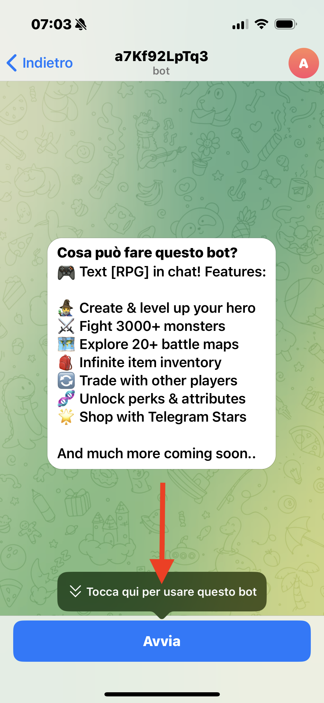
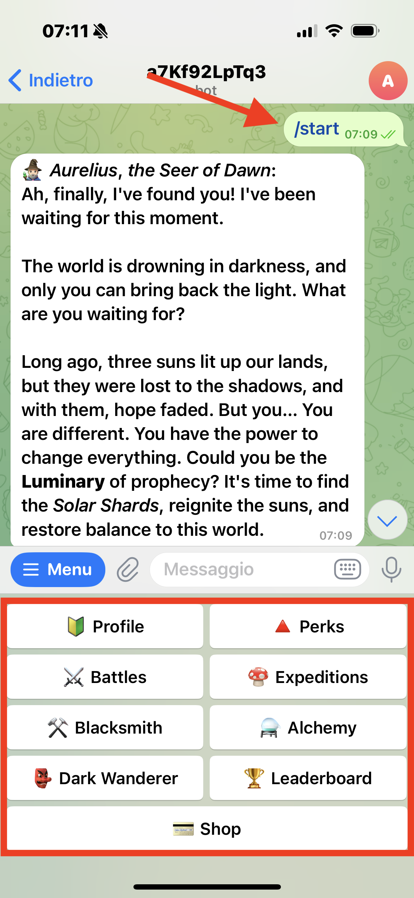
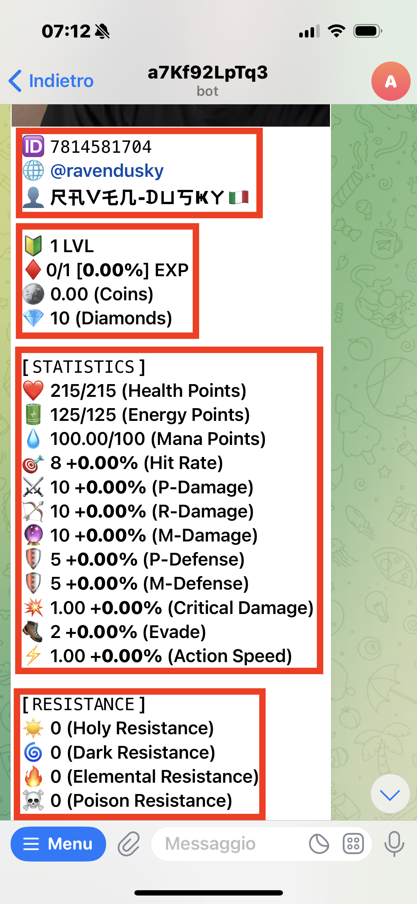
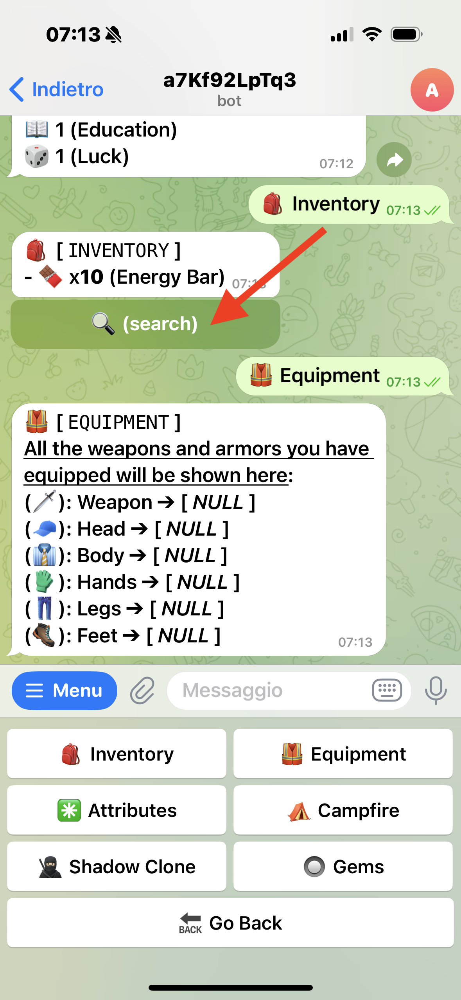
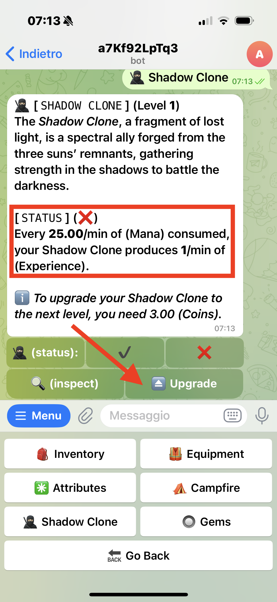
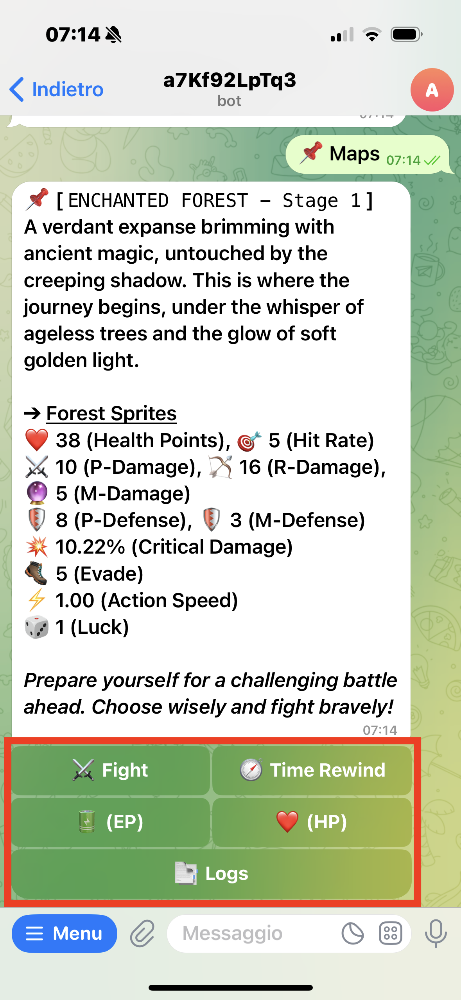
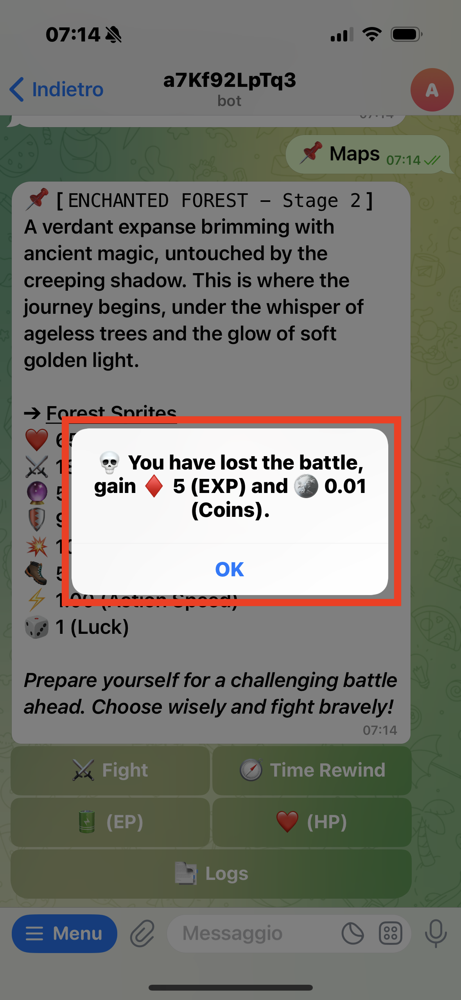

# 🧙‍♂️ Telegram RPG Bot

*A pure PHP text-based RPG adventure — played entirely in Telegram chat!*

## 🎮 What is this?

This is a **fully text-based RPG game** that runs entirely within Telegram, using the **Telegram Bot API**.
Built with 💯% pure **vanilla PHP** — no frameworks, no libraries — just raw PHP code, the way nature intended.
Database interactions are handled with **PDO** and classic **SQL queries** for all CRUD operations.

I built this game when I was still learning to code — **self-taught PHP**, no formal education, no fancy tools... just coffee, chaos, and `var_dump()`s. ☕😅
Despite that, over **100 players** joined and played it — and hey, **it worked**... mostly.
So if you see spaghetti in the code, just know: it's **functional spaghetti**. 🍝🧠

---

  
  
  
  

  
  
  

---

## 🗺️ Game Features

* **🧑‍🚀 Player Profile**:
  Each player has their own profile with an avatar, stats, level, XP, coins, and more.

* **⚔️ Battle Maps**:
  Explore over **20+ battle maps** and fight against **3000+ unique monsters**.
  Each map offers new challenges, enemies, and loot.

* **🎒 Infinite Inventory**:
  Store all your items — no limits, no weight restrictions, hoard away!
  Collect gear, consumables, and rare drops from your battles.

* **🧬 Perks & Attributes**:
  Level up your character with customizable **Perks**, **Specializations**, and **Attributes**.
  Build the hero *you* want to play.

* **🔄 Trading System**:
  Trade items with other players!
  Send and receive trade requests in **group chats** or **private messages** — player-driven economy FTW.

* **🌟 Telegram Stars Shop**:
  Buy in-game advantages with **Telegram Stars** via the integrated premium shop.

* **📢 Referral System**:
  Invite friends, earn rewards.
  Because what’s better than saving the world with your buddies?

---

## 💬 How to Play

1. Start the bot on Telegram.
2. Use simple commands to explore, battle, and upgrade.
3. All interactions happen right in the Telegram chat — no external apps needed.
4. Make decisions, build your character, and become the legend of the chat!

---

## ⚠️ A Little Disclaimer...

I built this game while I was still figuring out what `OOP` even meant.
It's not the cleanest code, and definitely not the most efficient...
But it was my **first big project**, and it worked! 🎉
**Over 100 players** used it, battled monsters, and leveled up — so hey, if it’s dumb but works... it’s not that dumb. 😎

---

## 🛠️ Tech Stack

* 💻 **Language**: Pure PHP (no frameworks)
* 🗃️ **Database**: MySQL with PDO
* 🧩 **APIs**: Telegram Bot API
* 📦 **No external libraries** – everything is built from scratch

---

## 📌 Final Note

Feel free to explore, fork, or laugh at my early coding choices.
If you're learning PHP — maybe you'll find something useful... or at least entertaining. 😄
Let me know if you want a badge section, installation instructions, or a screenshot example!
